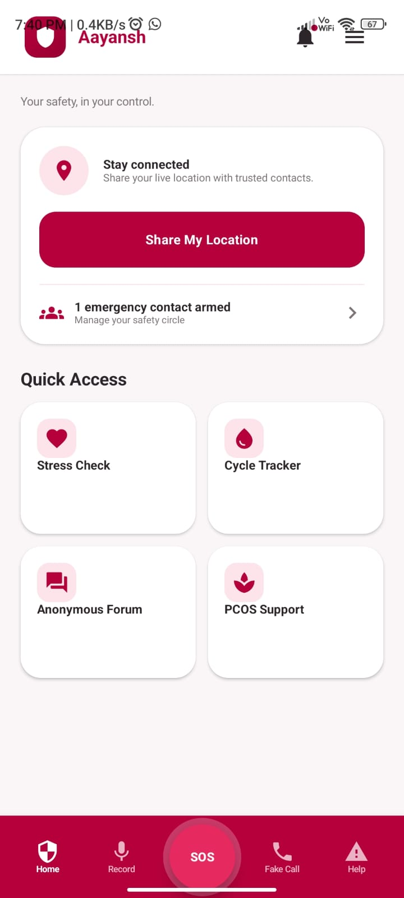
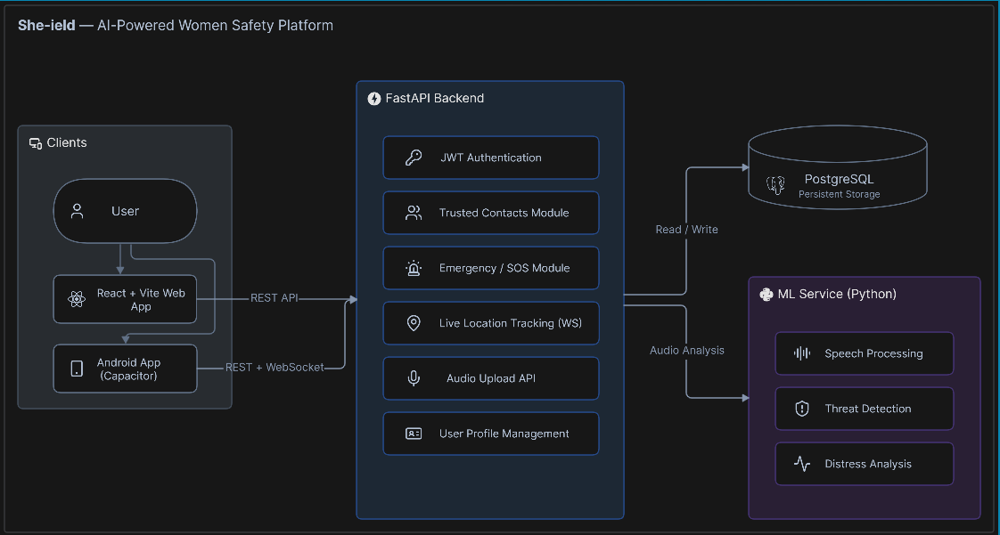
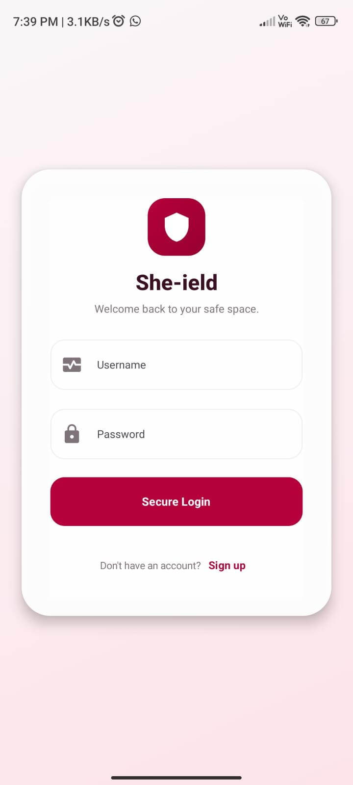
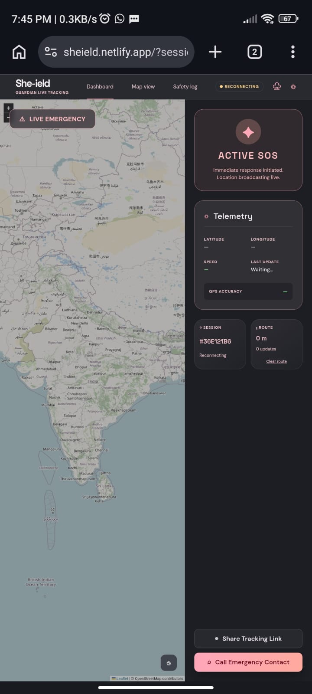
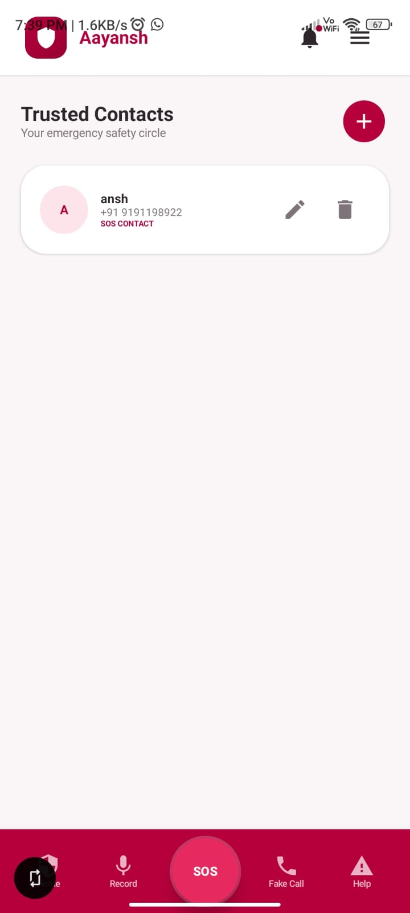
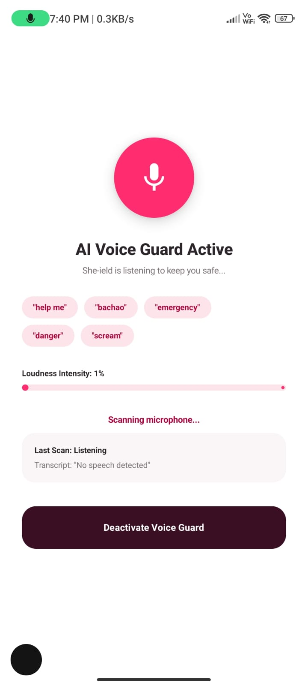

# 🛡️ She-ield

<p align="center">
  <b>AI-Powered Women's Safety Platform</b><br>
  Real-time emergency assistance, live location tracking, trusted contacts, and intelligent threat detection.
</p>

<p align="center">


\

</p>

---

# 📱 Application Preview

<p align="center">

</p>

> Replace the image above with your application screenshot or an animated GIF for a better presentation.

---

# ✨ Features

* 🚨 One-Tap SOS Emergency Alerts
* 📍 Real-Time Live Location Sharing
* 👥 Trusted Contact Management
* 🔐 Secure JWT Authentication
* 🤖 AI-Based Threat Detection
* 🎤 Emergency Audio Processing
* 📷 Evidence Collection
* ⚡ High Performance FastAPI Backend
* 🔄 Real-Time WebSocket Communication

---

# 🏗️ System Architecture

<p align="center">

</p>

> Replace this image with your architecture diagram.

---

# 🔗 Project Links

### 🌐 Frontend Repository

```text
https://github.com/Aayansh-singh-24/Fronted-Safe_her
```

```

### 📚 Backend API Documentation (Swagger)

```text
https://your-backend-domain/docs
```

### 📖 ReDoc Documentation

```text
https://your-backend-domain/redoc
```

---

# ⚠️ Backend Availability Notice

> **The backend is currently hosted on a temporary cloud instance.**
>
> The API documentation links above may become unavailable or change because the hosting server expires periodically. If the documentation is inaccessible, please check the latest deployment or run the backend locally.

---

# 🚀 Tech Stack

### Backend

* FastAPI
* SQLAlchemy
* PostgreSQL
* JWT Authentication
* WebSockets
* Pydantic

### AI / ML

* Python
* Speech Recognition
* Threat Detection Models

### DevOps

* Docker
* Docker Compose
* Nginx
* AWS EC2

---

# 📂 Repository Structure

```text
She-ield
│
├── backend/
├── ml-service/
├── assets/
│   ├── app-preview.png
│   └── architecture.png
├── docker-compose.yml
└── README.md
```

---

# ⚙️ Local Setup

## Clone the Repository

```bash
git clone https://github.com/yourusername/sheield.git

cd sheield
```

---

## Backend

```bash
cd backend

pip install -r requirements.txt

uvicorn app.main:app --reload
```

Backend

```text
http://127.0.0.1:8000
```

Swagger

```text
http://127.0.0.1:8000/docs
```


---

# 📸 More Screenshots

| login | Live Tracking |
|------|---------------|
|  |  |

| Trusted Contacts | SOS |
|------------------|-----|
|  |  |


---

# 📄 License

Licensed under the **MIT License**.
